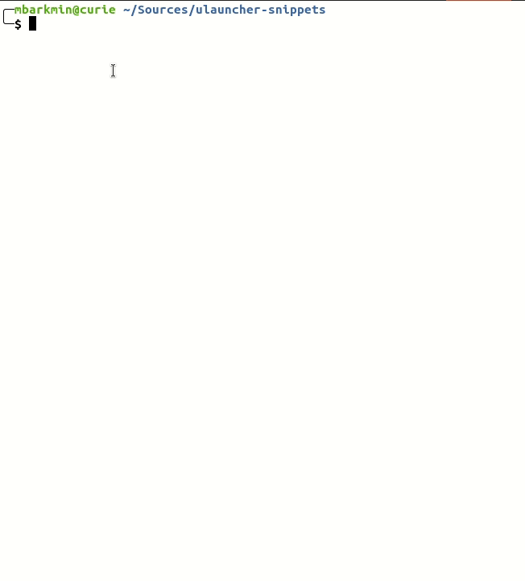

# Snippets Ulauncher extension



This Ulauncher extension enables you to copy snippets to your clipboard.

## Requirements

Before installing, make sure to install all the needed Python packages for your system:
```
pip3 install --user dateparser jinja2 python-frontmatter
```

If you want to use the xsel mode, which runs more reliable on my system you need to install xsel and select copy mode xsel in the extension settings.

```
sudo apt install xsel
```

## Install

Then open Ulauncher preferences window > extensions > add extension and paste the following URL:

```
https://github.com/mikebarkmin/ulauncher-snippets
```

## Usage

For your snippets to be loaded place j2-files in your snippets directory. You can configure the directory in the extension settings. Type `snip` in Ulauncher and select the snippet you want to use.

## Snippets

### Frontmatter

You can define a frontmatter for your snippet like so:

```
---
name: "Frontmatter Snippet"
description: "This is a description"
icon: "test-snippets/test.png"
vars:
    name: 
        label: "Name of the component"
        default: "NewComponent"
    other_var:
        label: "A var with no default"
---

My snippet {{ date('now') }}!
```

Each key of the frontmatter does have a fallback:

* `name`: Filename (e.g., date.j2 => date)
* `description`: First 40 characters of your snippet
* `icon`: The snippets extensions icon
* `vars`: An empty dictionary

If you define vars for your snippet the user will get inputs for each one and you can you them in your snippet. See below Placeholder -> Variables. To use the default value you need to input `-`.

### Placeholder

Placeholder need to be surrounded by `{{ placeholder }}`.

#### Variables

You can provide variables to the snippets. These are available via the following:

```
{{ vars("name") }}
```

#### Date

You can have a date placeholder which will be replaced by a date. The format is the following:

```
{{ date("date_expression", "date_format")}}
```

* date_expression can be any format supported by [dateparser](https://dateparser.readthedocs.io/en/latest/)
* date_format can be any format supported by [strftime](http://strftime.org/)

For example: `{{ date("now", "%Y-%M-%d") }}` => 2020-12-10

#### Clipboard

The clipboard offset allows you to specify which clipboard items you want to insert.

For example: `{{ clipboard() }}`

#### Random

You can have a random placeholder which replace by a random value.

* Random UUID: `{{ random_uuid() }}`
* Random Integer: `{{ random_int(min, max) }}`
* Random Item from List: `{{ random_item(["apple", "banana"]) }}`

### Filters

Placeholders can be modified by filters. Filters are separated from the placeholder by a pipe symbol `|` and may have optional arguments in parentheses.

For example `{{ clipboard | escape | title }}` will convert the characters &, <, >, ‘, and ” in string s to HTML-safe sequences (escape) and will convert it to titlecase.

Here you can find a [list of builtin filters](https://jinja.palletsprojects.com/en/2.11.x/templates/#list-of-builtin-filters).

Additionally, you can use:

* camelcase: A title -> aTitle
* pascalcase: A title -> ATitle
* snakecase: A title -> a_title
* kebabcase: A title -> a-title
* urldecode: Replace %xx escapes with their single-character equivalent (see [urllib](https://docs.python.org/3/library/urllib.parse.html#urllib.parse.unquote))

### Advance

Snippets are basically [Jinja2](https://jinja.palletsprojects.com/en/2.11.x/templates/) templates. This means that you can do very fancy stuff. Like conditional snippets or loop. See their documentation for more information.

## Snippet Repositories

This is a list of public repositories with snippets for inspiration.

- https://github.com/mikebarkmin/ulauncher-snippets-files/

Leave a pull request if you want your snippet repository to be listed.

## Developer

### Run Test

Currently, doctest is used for the `functions` module. To run the tests execute the following command:

```
python3 src/functions.py
``` 
